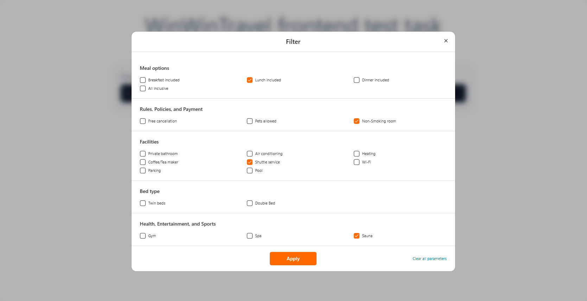
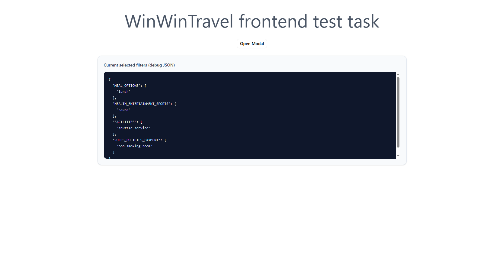

# WinWinTravel Frontend Tech Task

Implementation of the filter modal feature based on the technical task:  
[Original task repository](https://github.com/WinWin-travel/wwt-frontend-tech-task) 🚀

## ✨ Implemented Functionality

- Added a button on the Home page to open the filter modal.
- Built the filter modal based on `filterData.json`.
- Implemented prefilled values when reopening the modal (from previously saved filters).
- Added an `Apply` action with a confirmation dialog.
- Implemented confirmation flow:
  - ✅ Confirm: save new values to global state.
  - ❌ Cancel: keep previously saved values unchanged.
- Added JSON output of current selected filters on the Home page (debug visibility).

## 🧩 Implementation Details

- **Filter UI:** `src/pages/Home/ui/FilterModal.tsx`, `src/pages/Home/ui/FilterFields.tsx`
- **Model and types:** `src/pages/Home/model/types.ts`, `src/pages/Home/model/lib.ts`
- **Global state:** `src/shared/store/store.ts` (zustand)
- **Filter data query:** `src/shared/api/filterDataQuery.ts` (react-query)
- **Localization:** `src/shared/i18n/locales/en/filter.json`

## 🎨 UI Library Used

This implementation **explicitly uses `shadcn/ui` components** for modal and form-related UI parts (dialog, inputs, checkboxes, buttons, etc.) to keep the UI consistent, reusable, and easy to maintain.

## 📸 Screenshots

### 1) Opened filter modal with selected values


### 2) Apply confirmation dialog + resulting JSON on Home page


## 🛠️ Tech Stack

- React
- TypeScript
- react-query
- zustand
- tailwindcss
- i18n
- shadcn/ui

## ▶️ Run the Project

### Install dependencies

```bash
pnpm install
# or
npm install
```

### Development

```bash
pnpm dev
# or
npm run dev
```

### Build

```bash
pnpm build
# or
npm run build
```

### Preview production build

```bash
pnpm preview
# or
npm run preview
```

## ✅ CI Checks

The repository includes GitHub Actions for automatic code checks.
